# Module 5 - Exploring, Transforming, and Loading Data into the Data Warehouse using Apache Spark

This module teaches how to explore data stored in a data lake, transform the data, and load data into a relational data store. The student will explore Parquet and JSON files and use techniques to query and transform JSON files with hierarchical structures. Then the student will use Apache Spark to load data into the data warehouse and join Parquet data in the data lake with data in the dedicated SQL pool.

In this module, the student will be able to:

- Perform Data Exploration in Synapse Studio
- Ingest data with Spark notebooks in Azure Synapse Analytics
- Transform data with DataFrames in Spark pools in Azure Synapse Analytics
- Integrate SQL and Spark pools in Azure Synapse Analytics

## Lab details

- [Module 5 - Exploring, Transforming, and Loading Data into the Data Warehouse using Apache Spark](#module-5---exploring-transforming-and-loading-data-into-the-data-warehouse-using-apache-spark)
  - [Lab details](#lab-details)
  - [Perform Data Exploration in Synapse Studio](#perform-data-exploration-in-synapse-studio)
    - [Exploring data using the Preview functionality of Synapse Studio](#exploring-data-using-the-preview-functionality-of-synapse-studio)
    - [Using serverless SQL pools to explore files](#using-serverless-sql-pools-to-explore-files)
    - [Exploring and fixing data with Synapse Spark](#exploring-and-fixing-data-with-synapse-spark)
  - [Ingesting data with Spark notebooks in Azure Synapse Analytics](#ingesting-data-with-spark-notebooks-in-azure-synapse-analytics)
    - [Ingest and explore Parquet files from a data lake with Apache Spark for Azure Synapse](#ingest-and-explore-parquet-files-from-a-data-lake-with-apache-spark-for-azure-synapse)
  - [Transforming data with DataFrames in Spark pools in Azure Synapse Analytics](#transforming-data-with-dataframes-in-spark-pools-in-azure-synapse-analytics)
    - [Query and transform JSON data with Apache Spark for Azure Synapse](#query-and-transform-json-data-with-apache-spark-for-azure-synapse)
  - [Integrating SQL and Spark pools in Azure Synapse Analytics](#integrating-sql-and-spark-pools-in-azure-synapse-analytics)

## Perform Data Exploration in Synapse Studio

One of the first data engineering tasks typically performed during data ingestion is to explore the data that is to be imported. Data exploration allows engineers to understand better the contents of files being ingested. This process helps to identify any potential data quality issues that might hinder automated ingestion processes. Through exploration, we can gain insights into data types, data quality, and whether any processing needs to be performed on the files prior to importing the data into your data lake or using it for analytics workloads.

The engineers at Tailspin Traders have run into issues ingesting some of their sales data into the data warehouse, and have requested assistance in understanding how Synapse Studio can be used to help them resolve these issues. As the first step of this process, you need to explore the data to understand what is causing the issues they've encountered, and then provide them with a solution.

### Exploring data using the Preview functionality of Synapse Studio

Azure Synapse Studio provides numerous ways to explore data, from a simple preview interface to more complicated programmatic options using Synapse Spark notebooks. In this exercise, you will learn how to use these features to explore, identify, and fix problematic files. You will be exploring CSV files stored in the `wwi-02/sale-poc` folder of the data lake and learning about how to identify and fix issues.

1. Open Synapse Studio (<https://web.azuresynapse.net/>), and then navigate to the **Data** hub.

    

    > The Data hub is where you access your provisioned SQL pool databases and SQL serverless databases in your workspace, as well as external data sources, such as storage accounts and other linked services.

2. We want to access files stored in the workspace's primary data lake, so select the **Linked** tab within the Data hub.

    

3. On the Linked tab, expand **Azure Data Lake Storage Gen2** and then expand the **Primary** data lake for the workspace.

    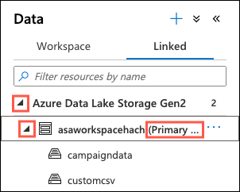

4. In the list of containers within the primary data lake storage account, select the `wwi-02` container.

    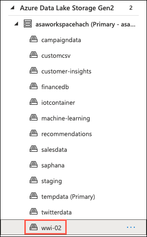

5. In the container explorer window, double-click on the `sale-poc` folder to open it.

    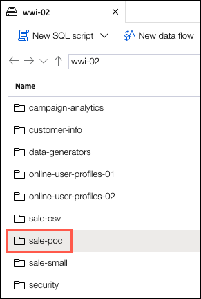

6. The `sale-poc` contains sales data for the month of May, 2017. There are 31 files in the folder, one for each day of the month. These files were imported by a temporary process to account for an issue with Tailspin's import process. Let's now take a few minutes to explore some of the files.

7. Right-click the first file in the list, `sale-20170501.csv`, and select **Preview** from the context menu.

    

8. The **Preview** functionality in Synapse Studio provides an quick and code-free way to examine the contents of a file. This is an effective way of getting a basic understanding of the features (columns) and types of data stored within them for an individual file.

    

    > While in the Preview dialog for `sale-20170501.csv`, take a moment to scroll through the file preview. Scrolling down shows there are a limited number of rows included in the preview, so this is just a glimpse into the structure of the file. Scrolling to the right allows you to see the number and names of the columns contained in the file.

9. Select **OK** to close the preview of the `sale-20170501.csv` file.

10. When performing data exploration, it is important to look at more than just one file, as it helps to get a more representative sample of the data. Let's look at the next file in the `wwi-02\sale-poc` folder. Right-click the `sale-20170502.csv` file and select **Preview** from the context menu.

    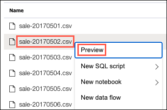

11. In the Preview dialog, you will immediately notice the structure of this file is different from the `sale-20170501.csv` file. No data rows appear in the preview and the column headers appear to contain data and not field names.

    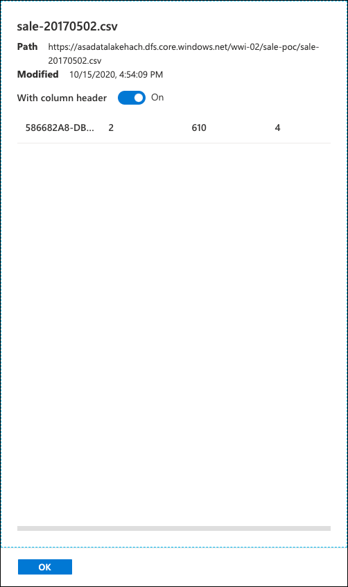

12. In the preview dialog, you have to option to turn off the **With column header** option. As it appears this file does not contain column headers, set this to off and inspect the results.

    

    > Setting the **With column headers** to off verifies that the file does not contain column headers. All columns have "(NO COLUMN NAME)" in the header. This setting moves the data down appropriately, and it appears this is only a single row. By scrolling to the right, you will notice that while there appears to only be a single row, there are many more columns than what we saw when previewing the first file. That file contained 11 columns.

13. Since we have seen two different file structures, let's look at another file to see if we can learn which format is more typical of the files within the `sale-poc` folder. Right-click the file named `sale-20170503.csv` and select **Preview**, as you have done previously.

    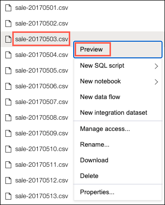

14. The preview shows the `sale-20170503.csv` file appears to have a structure similar to that found in `20170501.csv`.

    

15. Select **OK** to close the preview.

16. Now, take a few minutes to preview a few of the other files in the `sale-poc` folder. Do they have the same structure as the files for May 1st and 3rd?

### Using serverless SQL pools to explore files

The **Preview** functionality in Synapse Studio enables quick exploration of files, but doesn't allow us to look deeper into the data or gain much in the way of insights into files with issues. In this task, we will use the **serverless SQL pools (built-in)** functionality of Synapse to explore these files using T-SQL.

1. Right-click the `sale-20170501.csv` file again, this time selecting **New SQL Script** and **Select TOP 100 rows** from the context menu.

    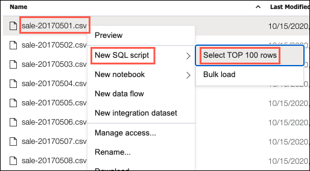

2. A new SQL script tab will open in Synapse Studio containing a `SELECT` statement to read the first 100 rows of the file. This provides another way to examine the contents of files. By limiting the number of rows being examined, we can speed up the exploration process, as queries to load all the data within the files will run slower.

    

    > T-SQL queries against files stored in the data lake leverage the `OPENROWSET` function. The `OPENROWSET` function can be referenced in the `FROM` clause of a query as if it were a table named `OPENROWSET`. It supports bulk operations through a built-in `BULK` provider that enables data from a file to be read and returned as a rowset. To learn more, you can review the to [OPENROWSET documentation](https://docs.microsoft.com/azure/synapse-analytics/sql/develop-openrowset).

3. Now, select **Run** on the toolbar to execute the query.

    

4. In the **Results** pane, observe the output.

    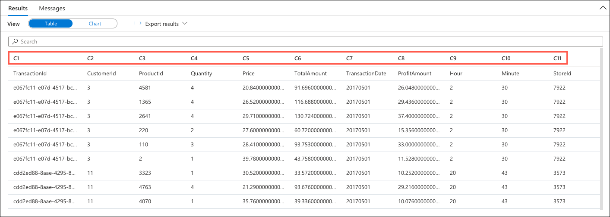

    > In the results, you will notice that the first row, containing the column headers, is rendered as a data row, and the columns are assigned names `C1` - `C11`. You can use the `FIRSTROW` parameter of the `OPENROWSET` function to specify the number of the first fow of the file to display as data. The default value is 1, so if a file contains a header row, the value can be set to 2 to skip the column headers. You can then specify the schema associated with the file using the `WITH` clause.

5. Let's modify the query to tell it to skip the header row. In your query window, insert the following code snippet immediately after `PARSER_VERSION='2.0'`:

    ```sql
    , FIRSTROW = 2
    ```

6. Next, insert the following SQL code to specify the schema between the final `)` and `AS [result]`:

    ```sql
    WITH (
        [TransactionId] varchar(50),
        [CustomerId] int,
        [ProductId] int,
        [Quantity] int,
        [Price] decimal(10,3),
        [TotalAmount] decimal(10,3),
        [TransactionDate] varchar(8),
        [ProfitAmount] decimal(10,3),
        [Hour] int,
        [Minute] int,
        [StoreId] int
    )
    ```

7. Your final query should look similar to the following (where `[YOUR-DATA-LAKE-ACCOUNT-NAME]` is the name of your primary data lake storage account):

    ```sql
    SELECT
        TOP 100 *
    FROM
        OPENROWSET(
            BULK 'https://[YOUR-DATA-LAKE-ACCOUNT-NAME].dfs.core.windows.net/wwi-02/sale-poc/sale-20170501.csv',
            FORMAT = 'CSV',
            PARSER_VERSION='2.0',
            FIRSTROW = 2
        ) WITH (
            [TransactionId] varchar(50),
            [CustomerId] int,
            [ProductId] int,
            [Quantity] int,
            [Price] decimal(10,3),
            [TotalAmount] decimal(10,3),
            [TransactionDate] varchar(8),
            [ProfitAmount] decimal(10,3),
            [Hour] int,
            [Minute] int,
            [StoreId] int
        ) AS [result]
    ```

    

    > Using the `OPENROWSET` function, you can now use T-SQL syntax to further explore your data. For example, you can use a `WHERE` clause to check various fields for `null` or other values that might need to be handled prior to using the data for advanced analytics workloads. With the schema specified, you can refer to fields by name to make this processes easier.

8. Close the SQL script tab by selecting the `X` to the left of the tab name.

    

9. If prompted, select **Close + discard changes** in the **Discard changes?** dialog.

    

10. We saw while using the **Preview** functionality that the `sale-20170502.csv` file is poorly formed. Let's see if we can learn more about the data in this file using T-SQL. Return to the `wwi-02` tabRight-click the `sale-20170502.csv` file and select **New SQL script** and **Select TOP 100 rows**.

    

11. As you did previously, select **Run** on the toolbar to execute the query.

    

12. Executing this query results in the error, `Error handling external file: 'Row larger than maximum allowed row size of 8388608 bytes found starting at byte 0.'`, being displayed in the **Messages** pane.

    

    > This error aligns with what we saw in the preview window for this file. In the preview we saw the data being separated in to columns, but all of the data was in a single row. This implies the data is being split into columns using the default field delimiter (comma). What appears to be missing, however, is a row terminator, `\r`.

13. At this point, we know the `sale-20170502.csv` file is a poorly formed CSV file, so we need to understand the format of the file better so we know how to fix the issues. T-SQL does not provide a mechanism to query the file for what the row terminator character is, so we can use a tool like [Notepad++](https://notepad-plus-plus.org/downloads/) to discover this.

    > If you do not have Notepad++ installed, feel free to simply view the next three steps.

14. By downloading the `sale-20170501.csv` and `sale-20170502.csv` files from your data lake, and then opening them in [Notepad++](https://notepad-plus-plus.org/downloads/), you can view the end of line characters within the files.

    > To display the row terminator symbols, open the **View** menu of Notepad++, then select **Show Symbol** and select **Show End of Line**.
    >
    > 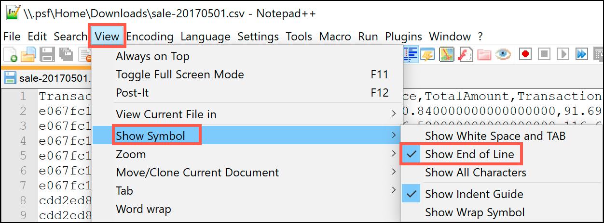

15. Opening the `sale-20170501.csv` file in Notepad++ reveals that the well-formatted files contain a line feed (LF) character at the end of each line.

    

16. Opening the `sale-20170502.csv` file in Notepad++ reveals that there are no row terminator characters. The data is entered into the CSV file as a single row, with only commas separating each field value.

    

    > Notice that the data in this file is comprised of a single row, but we can see where the different rows should be. The TransactionId GUID value can be seen every eleventh field in the row. This would indicate that the file encountered some sort of error while processing, which resulted in the column headers and row delimiters being missing from the file.

17. In order for us to fix the file, we need to use code. T-SQL and Synapse Pipelines do not have the ability to efficiently handle this type of issue. To address the problems with this file, we need to use a Synapse Spark notebook.

### Exploring and fixing data with Synapse Spark

In this task, you will use a Synapse Spark notebook to explore a few of the files in the `wwi-02/sale-poc` folder in the data lake. You will also use Python code to fix the issues with the `sale-20170502.csv` file, so all the files in the directory can be ingested using a Synapse Pipeline later in this lab.

1. In Synapse Studio, open the **Develop** hub.

    

2. Download the Jupyter notebook for this exercise from <https://solliancepublicdata.blob.core.windows.net/notebooks/Lab%202%20-%20Explore%20with%20Spark.ipynb>. This will download a file named `Lab 2 - Explore with Spark.ipynb`.

3. On the Develop hub, select the Add New Resource (**+**) button and then select **Import**.

    

4. Select the **Lab 2 - Explore with Spark** you downloaded in step 2 and select Open.

5. Follow the instructions contained within the notebook to complete the remainder of this task. When you are done with the notebook, return to this guide and continue with the next section.

Tailwind Traders has unstructured and semi-structured files from various data sources. Their data engineers want to use their Spark expertise to explore, ingest, and transform these files.

You recommend using Synapse Notebooks, which are integrated in the Azure Synapse Analytics workspace and used from within Synapse Studio.

## Ingesting data with Spark notebooks in Azure Synapse Analytics

### Ingest and explore Parquet files from a data lake with Apache Spark for Azure Synapse

Tailwind Traders has Parquet files stored in their data lake. They want to know how they can quickly access the files and explore them using Apache Spark.

You recommend using the Data hub to view the Parquet files in the connected storage account, then use the _new notebook_ context menu to create a new Synapse Notebook that loads a Spark dataframe with the contents of a selected Parquet file.

1. Open Synapse Studio (<https://web.azuresynapse.net/>).

2. Select the **Data** hub.

    

3. Select the **Linked** tab **(1)** and expand the `Azure Data Lake Storage Gen2` group, then expand the primary data lake storage account (*the name may differ from what you see here; it is the first storage account listed*). Select the **wwi-02** container **(2)** and browser to the `sale-small/Year=2010/Quarter=Q4/Month=12/Day=20101231` folder **(3)**. Right-click the Parquet file **(4)**, select **New notebook (5)**, then select **Load to DataFrame *6)**.

    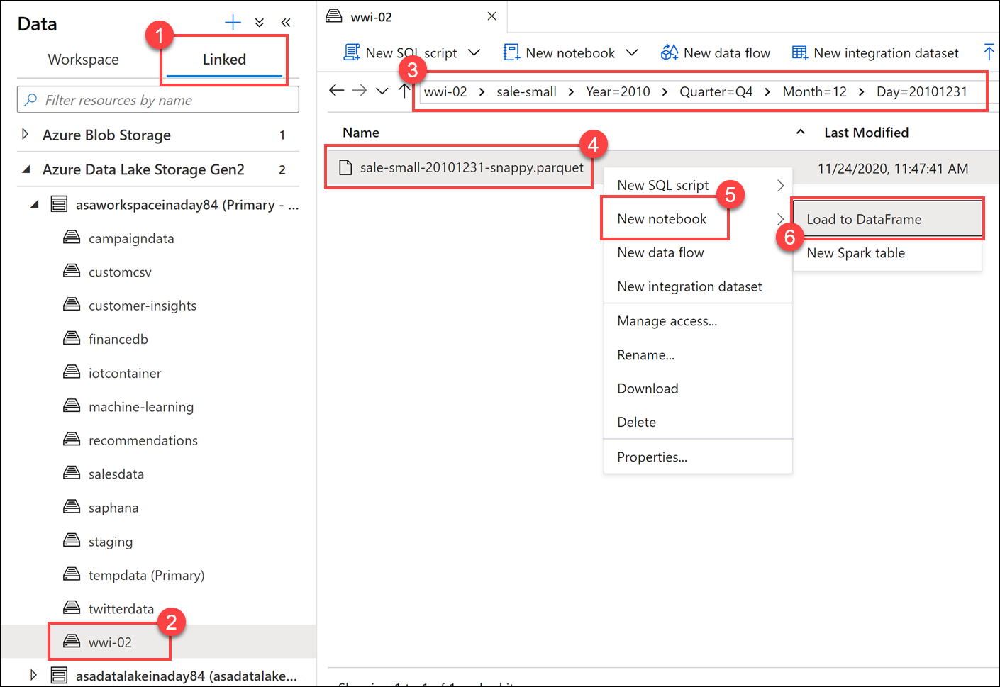

    This generates a notebook with PySpark code to load the data in a Spark dataframe and display 100 rows with the header.

4. Make sure the Spark pool is attached to the notebook.

    

    The Spark pool provides the compute for all notebook operations. If we look at the bottom of the notebook, we'll see that the pool has not started. When you run a cell in the notebook while the pool is idle, the pool will start and allocate resources. This is a one-time operation until the pool auto-pauses from being idle for too long.

    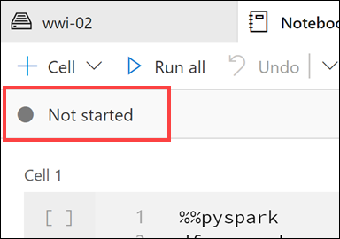

    > The auto-pause settings are configured on the Spark pool configuration in the Manage hub.

5. Add the following beneath the code in the cell to define a variable named `datalake` whose value is the name of the primary storage account (**replace the REPLACE_WITH_YOUR_DATALAKE_NAME value with the name of the storage account in line 2**):

    ```python
    datalake = 'REPLACE_WITH_YOUR_DATALAKE_NAME'
    ```

    

    This variable will be used in a couple cells later on.

6. Select **Run all** on the notebook toolbar to execute the notebook.

    

    > **Note:** The first time you run a notebook in a Spark pool, Azure Synapse creates a new session. This can take approximately 3-5 minutes.

    > **Note:** To run just the cell, either hover over the cell and select the _Run cell_ icon to the left of the cell, or select the cell then type **Ctrl+Enter** on your keyboard.

7. After the cell run is complete, change the View to **Chart** in the cell output.

    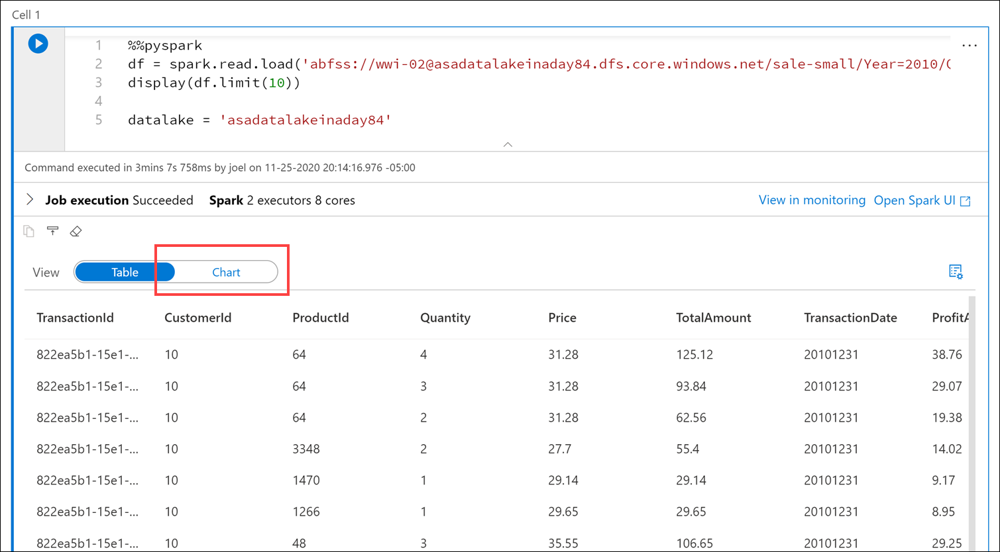

    By default, the cell outputs to a table view when we use the `display()` function. We see in the output the sales transaction data stored in the Parquet file for December 31, 2010. Let's select the **Chart** visualization to see a different view of the data.

8.  Select the **View options** button to the right.

    

9.  Set Key to **`ProductId`** and Values to **`TotalAmount` (1)**, then select **Apply (2)**.

    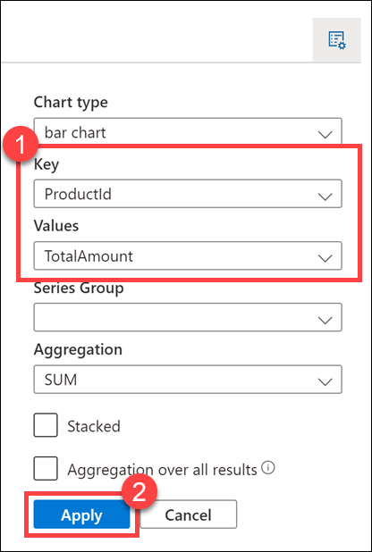

10. The chart visualization is displayed. Hover over the bars to view details.

    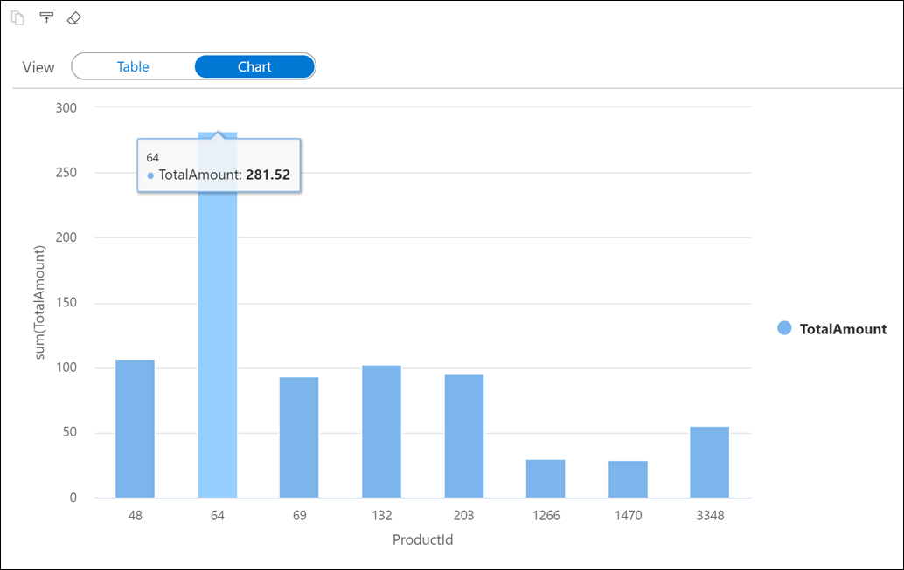

11. Create a new cell underneath by selecting **{} Add code** when hovering over the blank space at the bottom of the notebook.

    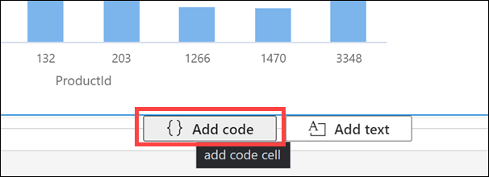

12. The Spark engine can analyze the Parquet files and infer the schema. To do this, enter the following in the new cell and **run** it:

    ```python
    df.printSchema()
    ```

    Your output should look like the following:

    ```text
    root
        |-- TransactionId: string (nullable = true)
        |-- CustomerId: integer (nullable = true)
        |-- ProductId: short (nullable = true)
        |-- Quantity: short (nullable = true)
        |-- Price: decimal(29,2) (nullable = true)
        |-- TotalAmount: decimal(29,2) (nullable = true)
        |-- TransactionDate: integer (nullable = true)
        |-- ProfitAmount: decimal(29,2) (nullable = true)
        |-- Hour: byte (nullable = true)
        |-- Minute: byte (nullable = true)
        |-- StoreId: short (nullable = true)
    ```

    Spark evaluates the file contents to infer the schema. This automatic inference is usually sufficient for data exploration and most transformation tasks. However, when you load data to an external resource like a SQL table, sometimes you need to declare your own schema and apply that to the dataset. For now, the schema looks good.

13. Now let's use the dataframe to use aggregates and grouping operations to better understand the data. Create a new cell and enter the following, then **run** the cell:

    ```python
    from pyspark.sql import SparkSession
    from pyspark.sql.types import *
    from pyspark.sql.functions import *

    profitByDateProduct = (df.groupBy("TransactionDate","ProductId")
        .agg(
            sum("ProfitAmount").alias("(sum)ProfitAmount"),
            round(avg("Quantity"), 4).alias("(avg)Quantity"),
            sum("Quantity").alias("(sum)Quantity"))
        .orderBy("TransactionDate"))
    display(profitByDateProduct.limit(100))
    ```

    > We import required Python libraries to use aggregation functions and types defined in the schema to successfully execute the query.

    The output shows the same data we saw in the chart above, but now with `sum` and `avg` aggregates **(1)**. Notice that we use the **`alias`** method **(2)** to change the column names.

    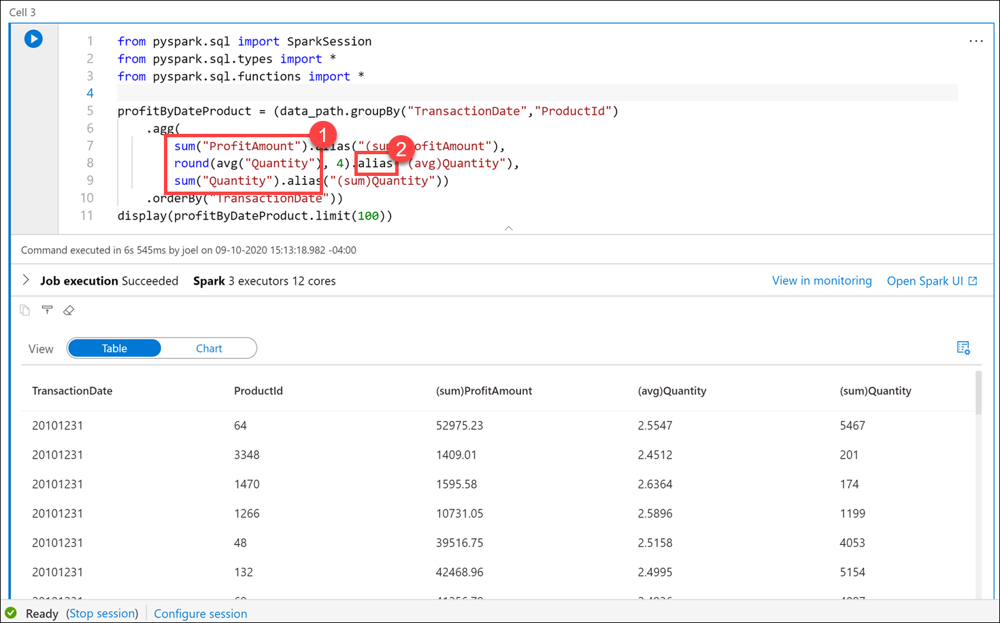

## Transforming data with DataFrames in Spark pools in Azure Synapse Analytics

### Query and transform JSON data with Apache Spark for Azure Synapse

In addition to the sales data, Tailwind Traders has customer profile data from an e-commerce system that provides top product purchases for each visitor of the site (customer) over the past 12 months. This data is stored within JSON files in the data lake. They have struggled with ingesting, exploring, and transforming these JSON files and want your guidance. The files have a hierarchical structure that they want to flatten before loading into relational data stores. They also wish to apply grouping and aggregate operations as part of the data engineering process.

You recommend using Synapse Notebooks to explore and apply data transformations on the JSON files.

1. Create a new cell in the Spark notebook, enter the following code and execute the cell:

    ```python
    df = (spark.read \
            .option('inferSchema', 'true') \
            .json('abfss://wwi-02@' + datalake + '.dfs.core.windows.net/online-user-profiles-02/*.json', multiLine=True)
        )

    df.printSchema()
    ```

    > The `datalake` variable we created in the first cell is used here as part of the file path.

    Your output should look like the following:

    ```text
    root
    |-- topProductPurchases: array (nullable = true)
    |    |-- element: struct (containsNull = true)
    |    |    |-- itemsPurchasedLast12Months: long (nullable = true)
    |    |    |-- productId: long (nullable = true)
    |-- visitorId: long (nullable = true)
    ```

    > Notice that we are selecting all JSON files within the `online-user-profiles-02` directory. Each JSON file contains several rows, which is why we specified the `multiLine=True` option. Also, we set the `inferSchema` option to `true`, which instructs the Spark engine to review the files and create a schema based on the nature of the data.

2. We have been using Python code in these cells up to this point. If we want to query the files using SQL syntax, one option is to create a temporary view of the data within the dataframe. Execute the following in a new cell to create a view named `user_profiles`:

    ```python
    # create a view called user_profiles
    df.createOrReplaceTempView("user_profiles")
    ```

3. Create a new cell. Since we want to use SQL instead of Python, we use the `%%sql` magic to set the language of the cell to SQL. Execute the following code in the cell:

    ```sql
    %%sql

    SELECT * FROM user_profiles LIMIT 10
    ```

    Notice that the output shows nested data for `topProductPurchases`, which includes an array of `productId` and `itemsPurchasedLast12Months` values. You can expand the fields by clicking the right triangle in each row.

    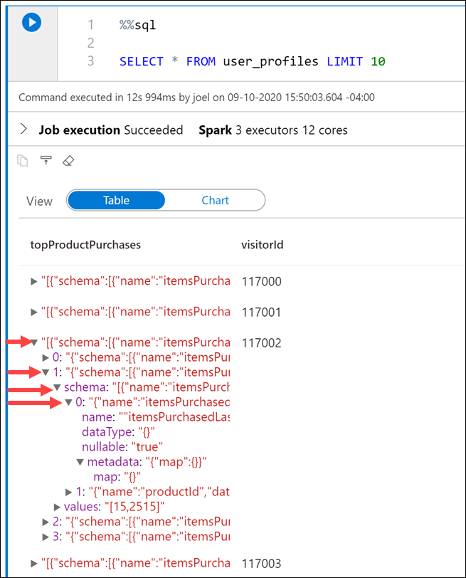

    This makes analyzing the data a bit difficult. This is because the JSON file contents look like the following:

    ```json
    [
    {
        "visitorId": 9529082,
        "topProductPurchases": [
        {
            "productId": 4679,
            "itemsPurchasedLast12Months": 26
        },
        {
            "productId": 1779,
            "itemsPurchasedLast12Months": 32
        },
        {
            "productId": 2125,
            "itemsPurchasedLast12Months": 75
        },
        {
            "productId": 2007,
            "itemsPurchasedLast12Months": 39
        },
        {
            "productId": 1240,
            "itemsPurchasedLast12Months": 31
        },
        {
            "productId": 446,
            "itemsPurchasedLast12Months": 39
        },
        {
            "productId": 3110,
            "itemsPurchasedLast12Months": 40
        },
        {
            "productId": 52,
            "itemsPurchasedLast12Months": 2
        },
        {
            "productId": 978,
            "itemsPurchasedLast12Months": 81
        },
        {
            "productId": 1219,
            "itemsPurchasedLast12Months": 56
        },
        {
            "productId": 2982,
            "itemsPurchasedLast12Months": 59
        }
        ]
    },
    {
        ...
    },
    {
        ...
    }
    ]
    ```

4. PySpark contains a special [`explode` function](https://spark.apache.org/docs/latest/api/python/pyspark.sql.html?highlight=explode#pyspark.sql.functions.explode), which returns a new row for each element of the array. This will help flatten the `topProductPurchases` column for better readability or for easier querying. Execute the following in a new cell:

    ```python
    from pyspark.sql.functions import udf, explode

    flat=df.select('visitorId',explode('topProductPurchases').alias('topProductPurchases_flat'))
    flat.show(100)
    ```

    In this cell, we created a new dataframe named `flat` that includes the `visitorId` field and a new aliased field named `topProductPurchases_flat`. As you can see, the output is a bit easier to read and, by extension, easier to query.

    

5. Create a new cell and execute the following code to create a new flattened version of the dataframe that extracts the `topProductPurchases_flat.productId` and `topProductPurchases_flat.itemsPurchasedLast12Months` fields to create new rows for each data combination:

    ```python
    topPurchases = (flat.select('visitorId','topProductPurchases_flat.productId','topProductPurchases_flat.itemsPurchasedLast12Months')
        .orderBy('visitorId'))

    topPurchases.show(100)
    ```

    In the output, notice that we now have multiple rows for each `visitorId`.

    

6. Let's order the rows by the number of items purchased in the last 12 months. Create a new cell and execute the following code:

    ```python
    # Let's order by the number of items purchased in the last 12 months
    sortedTopPurchases = topPurchases.orderBy("itemsPurchasedLast12Months")

    display(sortedTopPurchases.limit(100))
    ```

    

7. How do we sort in reverse order? One might conclude that we could make a call like this: `topPurchases.orderBy("itemsPurchasedLast12Months desc")`. Try it in a new cell:

    ```python
    topPurchases.orderBy("itemsPurchasedLast12Months desc")
    ```

    

    Notice that there is an `AnalysisException` error, because `itemsPurchasedLast12Months desc` does not match up with a column name.

    Why does this not work?

    - The `DataFrames` API is built upon an SQL engine.
    - There is a lot of familiarity with this API and SQL syntax in general.
    - The problem is that `orderBy(..)` expects the name of the column.
    - What we specified was an SQL expression in the form of **requests desc**.
    - What we need is a way to programmatically express such an expression.
    - This leads us to the second variant, `orderBy(Column)` and more specifically, the class `Column`.

8. The **Column** class is an object that encompasses more than just the name of the column, but also column-level-transformations, such as sorting in a descending order. Execute the following code in a new cell:

    ```python
    sortedTopPurchases = (topPurchases
        .orderBy( col("itemsPurchasedLast12Months").desc() ))

    display(sortedTopPurchases.limit(100))
    ```

    Notice that the results are now sorted by the `itemsPurchasedLast12Months` column in descending order, thanks to the **`desc()`** method on the **`col`** object.

    

9. How many *types* of products did each customer purchase? To figure this out, we need to group by `visitorId` and aggregate on the number of rows per customer. Execute the following code in a new cell:

    ```python
    groupedTopPurchases = (sortedTopPurchases.select("visitorId")
        .groupBy("visitorId")
        .agg(count("*").alias("total"))
        .orderBy("visitorId") )

    display(groupedTopPurchases.limit(100))
    ```

    Notice how we use the **`groupBy`** method on the `visitorId` column, and the **`agg`** method over a count of records to display the total for each customer.

    

10. How many *total items* did each customer purchase? To figure this out, we need to group by `visitorId` and aggregate on the sum of `itemsPurchasedLast12Months` values per customer. Execute the following code in a new cell:

    ```python
    groupedTopPurchases = (sortedTopPurchases.select("visitorId","itemsPurchasedLast12Months")
        .groupBy("visitorId")
        .agg(sum("itemsPurchasedLast12Months").alias("totalItemsPurchased"))
        .orderBy("visitorId") )

    display(groupedTopPurchases.limit(100))
    ```

    Here we group by `visitorId` once again, but now we use a **`sum`** over the `itemsPurchasedLast12Months` column in the **`agg`** method. Notice that we included the `itemsPurchasedLast12Months` column in the `select` statement so we could use it in the `sum`.

    

## Integrating SQL and Spark pools in Azure Synapse Analytics

Tailwind Traders wants to write to the SQL database assodicated with dedicated SQL pool after performing data engineering tasks in Spark, then reference that SQL database as a source for joining with Spark dataframes that contain data from other files.

You decide to use the Apache Spark to Synapse SQL connector to efficiently transfer data between Spark databases and SQL databases in Azure Synapse.

Transferring data between Spark databases and SQL databases can be done using JDBC. However, given two distributed systems such as Spark pools and SQL pools, JDBC tends to be a bottleneck with serial data transfer.

The Apache Spark pool to Synapse SQL connector is a data source implementation for Apache Spark. It uses the Azure Data Lake Storage Gen2 and PolyBase in dedicated SQL pools to efficiently transfer data between the Spark cluster and the Synapse SQL instance.

1. We have been using Python code in these cells up to this point. If we want to use the Apache Spark pool to Synapse SQL connector (`sqlanalytics`), one option is to create a temporary view of the data within the dataframe. Execute the following in a new cell to create a view named `top_purchases`:

    ```python
    # Create a temporary view for top purchases so we can load from Scala
    topPurchases.createOrReplaceTempView("top_purchases")
    ```

    We created a new temporary view from the `topPurchases` dataframe that we created earlier and which contains the flattened JSON user purchases data.

2. We must execute code that uses the Apache Spark pool to Synapse SQL connector in Scala. To do this, we add the `%%spark` magic to the cell. Execute the following in a new cell to read from the `top_purchases` view:

    ```java
    %%spark
    // Make sure the name of the dedcated SQL pool (SQLPool01 below) matches the name of your SQL pool.
    val df = spark.sqlContext.sql("select * from top_purchases")
    df.write.sqlanalytics("SQLPool01.wwi.TopPurchases", Constants.INTERNAL)
    ```

    > **Note**: The cell may take over a minute to execute. If you have run this command before, you will receive an error stating that "There is already and object named.." because the table already exists.

    After the cell finishes executing, let's take a look at the list of SQL tables to verify that the table was successfully created for us.

3. **Leave the notebook open**, then navigate to the **Data** hub (if not already selected).

    

4. Select the **Workspace** tab **(1)**, expand the SQL database, select the **ellipses (...)** on Tables **(2)** and select **Refresh (3)**. Expand the **`wwi.TopPurchases`** table and columns **(4)**.

    

    As you can see, the `wwi.TopPurchases` table was automatically created for us, based on the derived schema of the Spark dataframe. The Apache Spark pool to Synapse SQL connector was responsible for creating the table and efficiently loading the data into it.

5. **Return to the notebook** and execute the following in a new cell to read sales data from all the Parquet files located in the `sale-small/Year=2019/Quarter=Q4/Month=12/` folder:

    ```python
    dfsales = spark.read.load('abfss://wwi-02@' + datalake + '.dfs.core.windows.net/sale-small/Year=2019/Quarter=Q4/Month=12/*/*.parquet', format='parquet')
    display(dfsales.limit(10))
    ```

    > **Note**: It can take over 3 minutes for this cell to execute.
    >
    > The `datalake` variable we created in the first cell is used here as part of the file path.

    

    Compare the file path in the cell above to the file path in the first cell. Here we are using a relative path to load **all December 2019 sales** data from the Parquet files located in `sale-small`, vs. just December 31, 2010 sales data.

    Next, let's load the `TopSales` data from the SQL table we created earlier into a new Spark dataframe, then join it with this new `dfsales` dataframe. To do this, we must once again use the `%%spark` magic on a new cell since we'll use the Apache Spark pool to Synapse SQL connector to retrieve data from the SQL database. Then we need to add the dataframe contents to a new temporary view so we can access the data from Python.

6. Execute the following in a new cell to read from the `TopSales` SQL table and save it to a temporary view:

    ```java
    %%spark
    // Make sure the name of the SQL pool (SQLPool01 below) matches the name of your SQL pool.
    val df2 = spark.read.sqlanalytics("SQLPool01.wwi.TopPurchases")
    df2.createTempView("top_purchases_sql")

    df2.head(10)
    ```

    

    The cell's language is set to `Scala` by using the `%%spark` magic **(1)** at the top of the cell. We declared a new variable named `df2` as a new DataFrame created by the `spark.read.sqlanalytics` method, which reads from the `TopPurchases` table **(2)** in the SQL database. Then we populated a new temporary view named `top_purchases_sql` **(3)**. Finally, we showed the first 10 records with the `df2.head(10))` line **(4)**. The cell output displays the dataframe values **(5)**.

7. Execute the following in a new cell to create a new dataframe in Python from the `top_purchases_sql` temporary view, then display the first 10 results:

    ```python
    dfTopPurchasesFromSql = sqlContext.table("top_purchases_sql")

    display(dfTopPurchasesFromSql.limit(10))
    ```

    

8. Execute the following in a new cell to join the data from the sales Parquet files and the `TopPurchases` SQL database:

    ```python
    inner_join = dfsales.join(dfTopPurchasesFromSql,
        (dfsales.CustomerId == dfTopPurchasesFromSql.visitorId) & (dfsales.ProductId == dfTopPurchasesFromSql.productId))

    inner_join_agg = (inner_join.select("CustomerId","TotalAmount","Quantity","itemsPurchasedLast12Months","top_purchases_sql.productId")
        .groupBy(["CustomerId","top_purchases_sql.productId"])
        .agg(
            sum("TotalAmount").alias("TotalAmountDecember"),
            sum("Quantity").alias("TotalQuantityDecember"),
            sum("itemsPurchasedLast12Months").alias("TotalItemsPurchasedLast12Months"))
        .orderBy("CustomerId") )

    display(inner_join_agg.limit(100))
    ```

    In the query, we joined the `dfsales` and `dfTopPurchasesFromSql` dataframes, matching on `CustomerId` and `ProductId`. This join combined the `TopPurchases` SQL table data with the December 2019 sales Parquet data **(1)**.

    We grouped by the `CustomerId` and `ProductId` fields. Since the `ProductId` field name is ambiguous (it exists in both dataframes), we had to fully-qualify the `ProductId` name to refer to the one in the `TopPurchases` dataframe **(2)**.

    Then we created an aggregate that summed the total amount spent on each product in December, the total number of product items in December, and the total product items purchased in the last 12 months **(3)**.

    Finally, we displayed the joined and aggregated data in a table view.

    > **Note**: Feel free to click on the column headers in the Table view to sort the result set.

    
