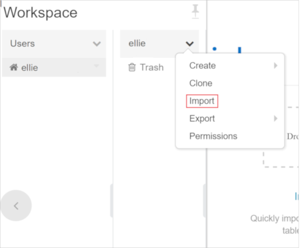

# Module 15 - Creating a Stream Processing Solution with Event Hubs and Azure Databricks

In this module, students will learn how to ingest and process streaming data at scale with Event Hubs and Spark Structured Streaming in Azure Databricks. The student will learn the key features and uses of Structured Streaming. The student will implement sliding windows to aggregate over chunks of data and apply watermarking to remove stale data. Finally, the student will connect to Event Hubs to read and write streams.

In this module, the student will be able to:

- Know the key features and uses of Structured Streaming
- Stream data from a file and write it out to a distributed file system
- Use sliding windows to aggregate over chunks of data rather than all data
- Apply watermarking to remove stale data
- Connect to Event Hubs read and write streams

## Lab details

- [Module 15 - Creating a Stream Processing Solution with Event Hubs and Azure Databricks](#module-15---creating-a-stream-processing-solution-with-event-hubs-and-azure-databricks)
  - [Lab details](#lab-details)
  - [Concepts](#concepts)
  - [Event Hubs and Spark Structured Streaming](#event-hubs-and-spark-structured-streaming)
  - [Streaming concepts](#streaming-concepts)
  - [Lab](#lab)
    - [Before the hands-on lab](#before-the-hands-on-lab)
      - [Task 1 - Create and configure the Azure Databricks workspace](#task-1---create-and-configure-the-azure-databricks-workspace)
      - [Task 2: Clone the Databricks archive](#task-2-clone-the-databricks-archive)
    - [Exercise 1: Complete the Structured Streaming Concepts notebook](#exercise-1-complete-the-structured-streaming-concepts-notebook)
    - [Exercise 2: Complete the Working with Time Windows notebook](#exercise-2-complete-the-working-with-time-windows-notebook)
    - [Exercise 3: Complete the Structured Streaming with Azure EventHubs notebook](#exercise-3-complete-the-structured-streaming-with-azure-eventhubs-notebook)

## Concepts

Apache Spark Structured Streaming is a fast, scalable, and fault-tolerant stream processing API. You can use it to perform analytics on your streaming data in near real time.

With Structured Streaming, you can use SQL queries to process streaming data in the same way that you would process static data. The API continuously increments and updates the final data.

## Event Hubs and Spark Structured Streaming

Azure Event Hubs is a scalable real-time data ingestion service that processes millions of data in a matter of seconds. It can receive large amounts of data from multiple sources and stream the prepared data to Azure Data Lake or Azure Blob storage.

Azure Event Hubs can be integrated with Spark Structured Streaming to perform processing of messages in near real time. You can query and analyze the processed data as it comes by using a Structured Streaming query and Spark SQL.

## Streaming concepts

Stream processing is where you continuously incorporate new data into Data Lake storage and compute results. The streaming data comes in faster than it can be consumed when using traditional batch-related processing techniques. A stream of data is treated as a table to which data is continuously appended. Examples of such data include bank card transactions, Internet of Things (IoT) device data, and video game play events.

A streaming system consists of:

- Input sources such as Kafka, Azure Event Hubs, IoT Hub, files on a distributed system, or TCP-IP sockets
- Stream processing using Structured Streaming, forEach sinks, memory sinks, etc.

## Lab

You need to complete the exercises within Databricks Notebooks. To begin, you need to have access to an Azure Databricks workspace. If you do not have a workspace available, follow the instructions below. Otherwise, you can skip ahead to the `Clone the Databricks archive` step.

### Before the hands-on lab

Before stepping through the exercises in this lab, make sure you have access to an Azure Databricks workspace with an available cluster. Perform the tasks below to configure the workspace.

#### Task 1 - Create and configure the Azure Databricks workspace

Follow the [lab 15 setup instructions](https://github.com/solliancenet/microsoft-data-engineering-ilt-deploy/blob/main/setup/15/lab-01-setup.md) to create and configure the workspace.

#### Task 2: Clone the Databricks archive

1. If you do not currently have your Azure Databricks workspace open: in the Azure portal, navigate to your deployed Azure Databricks workspace and select **Launch Workspace**.
1. In the left pane, select **Workspace** > **Users**, and select your username (the entry with the house icon).
1. In the pane that appears, select the arrow next to your name, and select **Import**.

    

1. In the **Import Notebooks** dialog box, select the URL and paste in the following URL:

 ```
  https://github.com/solliancenet/microsoft-learning-paths-databricks-notebooks/blob/master/data-engineering/DBC/10-Structured-Streaming.dbc?raw=true
 ```

1. Select **Import**.
1. Select the **10-Structured-Streaming** folder that appears.

### Exercise 1: Complete the Structured Streaming Concepts notebook

Open the **1.Structured-Streaming-Concepts** notebook. Make sure you attach your cluster to the notebook before following the instructions and running the cells within.

Within the notebook, you will:

- Stream data from a file and write it out to a distributed file system
- List active streams
- Stop active streams

After you've completed the notebook, return to this screen, and continue to the next step.

### Exercise 2: Complete the Working with Time Windows notebook

In your Azure Databricks workspace, open the **10-Structured-Streaming** folder that you imported within your user folder.

Open the **2.Time-Windows** notebook. Make sure you attach your cluster to the notebook before following the instructions and running the cells within.

Within the notebook, you will:

- Use sliding windows to aggregate over chunks of data rather than all data
- Apply watermarking to throw away stale old data that you do not have space to keep
- Plot live graphs using `display`

After you've completed the notebook, return to this screen, and continue to the next step.

### Exercise 3: Complete the Structured Streaming with Azure EventHubs notebook

In your Azure Databricks workspace, open the **10-Structured-Streaming** folder that you imported within your user folder.

Open the **3.Streaming-With-Event-Hubs-Demo** notebook. Make sure you attach your cluster to the notebook before following the instructions and running the cells within.

Within the notebook, you will:

- Connect to Event Hubs and write a stream to your event hub
- Read a stream from your event hub
- Define a schema for the JSON payload and parse the data do display it within a table
